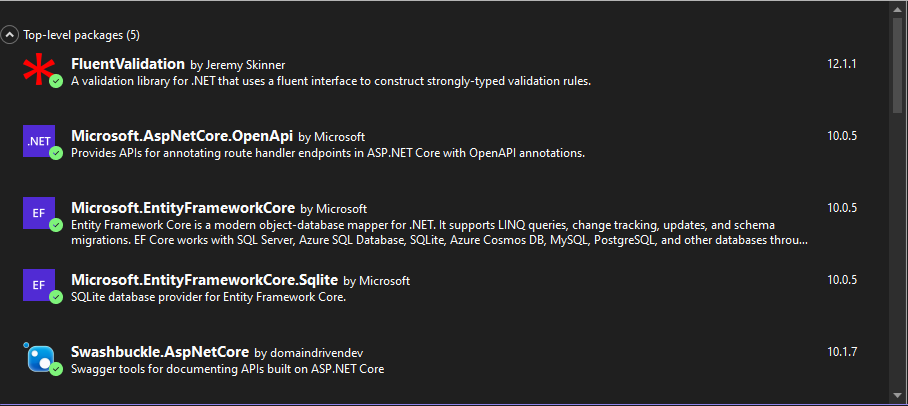

# ProductClientHub

## Tecnologias utilizadas

## Descrição

Esta aplicação foi desenvolvida com a ajuda da Faculdade de Tecnologia Rocketseat e tem como objetivo criar um CRUD simples para a API de clientes relacionada com a API de produtos.

## Estrutura da aplicação

A solução está organizada seguindo princípios de separação de responsabilidades, facilitando a manutenção, escalabilidade e testes.

### ProductClientHub.API

Projeto principal da aplicação (camada de apresentação e configuração da API).

#### Controllers

Responsável por expor os endpoints da API e receber as requisições HTTP.

#### Entities

Contém as entidades de domínio utilizadas na aplicação.

#### Filters

Filtros para tratamento de requisições, respostas ou exceções globais.

#### Infrastructure

Camada responsável por acesso a dados e configurações técnicas.

- ProductClientHubDbContext.cs: Contexto do banco de dados (Entity Framework Core).

#### UseCases

Implementação das regras de negócio da aplicação (casos de uso).

#### Program.cs

Ponto de entrada da aplicação e configuração de serviços.

### ProductClientHub.Communication

Projeto responsável pela comunicação entre camadas.

#### Requests

Modelos de dados utilizados para entrada (requisições da API).

#### Responses

Modelos de dados utilizados para saída (respostas da API).

### ProductClientHub.Exceptions

Projeto dedicado ao tratamento de exceções da aplicação.

#### ExceptionBase

Estrutura base para exceções personalizadas.

## Como executar

### Baixando a aplicação
- Clique no botão verde <> Code ▼ → Clique em HTTPS → Copie a URL.
- Abra o Git Bash → Execute o comando git clone <URL copiada> → Entre na pasta da aplicação.

### Abrindo o Visual Studio

Dentro da pasta do projeto, encontre o arquivo `ProductClientHub` → clique com o botão direito -> selecione a opção `Abrir com Microsoft Visual Studio`.

### Verificando pacotes disponíveis

Verifique se os seguintes pacotes estão disponíveis:

Para confirmar isso, clique com o botão direito no `ProductClientHub.API` → selecione a opção `Manage NuGet Packages...` → clique na aba `Installed`.

Caso algum dos pacotes não esteja instalado, clique na aba `Browse` → digite o nome do pacote -> clique em `Install`.

### Atualizando a url do banco

Vá até o arquivo `ProductClientHub.API.Infraestructure.ProductClientHubDbContext` e atualize o caminho do arquivo referente ao banco na linha `optionsBuilder.UseSqlite("Data Source=...")`.

### Rodando o projeto

Pressione `F5` para iniciar o programa e acesse o link `https://localhost:7096/swagger/index.html`. Você será direcionado para uma página Swagger com os endpoints do cliente e do produto.